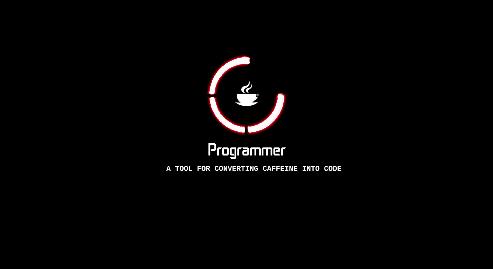

### 👋


### ⏳ Year Progress

<!-- YEAR_PROGRESS_START -->
```
[ ☣️ Year Progress | 2026-01-04 18:26:03 ]
[ ⠂⠀⠀⠀⠀⠀⠀⠀⠀⠀⠀⠀⠀⠀⠀⠀ ] 1.03%
<Loading module...>
```

[](https://github.com/mdsarfarazalam840)
*⚡ CI monitored; status auto-updates.*

<!-- YEAR_PROGRESS_END -->





<p align="center">
  
</p>


[](https://github.com/ryo-ma/github-profile-trophy)

<br>


<!-- Technical Skills -->

                 


<p align="center">


<p align="center">


<!--[](https://github.com/ashutosh00710/github-readme-activity-graph)-->
[](https://github.com/ashutosh00710/github-readme-activity-graph)


  

  

 <p align="center">
   <a href="https://discordapp.com/users/MdSarfaraz#0520" target="blank"></a> <a href="https://www.linkedin.com/in/md-alam-bb809240/" target="blank"></a>  
   
<br>
<br>
<a href="https://twitter.com/MdSarfaraz840" target="blank"></a>
</p>  
  

  
<!--
**mdsarfarazalam840/mdsarfarazalam840** is a ✨ _special_ ✨ repository because its `README.md` (this file) appears on your GitHub profile.

Here are some ideas to get you started:

- 🔭 I’m currently working on ...
- 🌱 I’m currently learning ...
- 👯 I’m looking to collaborate on ...
- 🤔 I’m looking for help with ...
- 💬 Ask me about ...
- 📫 How to reach me: ...
- 😄 Pronouns: ...
- ⚡ Fun fact: ...
-->


<!--START_SECTION:waka-->


**🐱 My GitHub Data** 

> 📦 56.4 kB Used in GitHub's Storage 
 > 
> 🏆 1 Contributions in the Year 2026
 > 
> 🚫 Not Opted to Hire
 > 
> 📜 120 Public Repositories 
 > 
> 🔑 0 Private Repositories 
 > 
**I'm an Early 🐤** 

```text
🌞 Morning                96 commits          █████████████░░░░░░░░░░░░   53.63 % 
🌆 Daytime                35 commits          █████░░░░░░░░░░░░░░░░░░░░   19.55 % 
🌃 Evening                42 commits          ██████░░░░░░░░░░░░░░░░░░░   23.46 % 
🌙 Night                  6 commits           █░░░░░░░░░░░░░░░░░░░░░░░░   03.35 % 
```
📅 **I'm Most Productive on Monday** 

```text
Monday                   63 commits          █████████░░░░░░░░░░░░░░░░   35.20 % 
Tuesday                  25 commits          ███░░░░░░░░░░░░░░░░░░░░░░   13.97 % 
Wednesday                25 commits          ███░░░░░░░░░░░░░░░░░░░░░░   13.97 % 
Thursday                 5 commits           █░░░░░░░░░░░░░░░░░░░░░░░░   02.79 % 
Friday                   33 commits          █████░░░░░░░░░░░░░░░░░░░░   18.44 % 
Saturday                 10 commits          █░░░░░░░░░░░░░░░░░░░░░░░░   05.59 % 
Sunday                   18 commits          ███░░░░░░░░░░░░░░░░░░░░░░   10.06 % 
```


📊 **This Week I Spent My Time On** 

```text
🕑︎ Time Zone: Asia/Kolkata

💬 Programming Languages: 
TypeScript               1 hr 26 mins        █████████░░░░░░░░░░░░░░░░   37.93 % 
Markdown                 58 mins             ██████░░░░░░░░░░░░░░░░░░░   25.51 % 
Bash                     30 mins             ███░░░░░░░░░░░░░░░░░░░░░░   13.24 % 
JavaScript               27 mins             ███░░░░░░░░░░░░░░░░░░░░░░   12.16 % 
Other                    22 mins             ██░░░░░░░░░░░░░░░░░░░░░░░   09.73 % 

🔥 Editors: 
Antigravity              3 hrs 14 mins       █████████████████████░░░░   84.92 % 
VS Code                  34 mins             ████░░░░░░░░░░░░░░░░░░░░░   15.08 % 

🐱‍💻 Projects: 
gd-index                 3 hrs 13 mins       █████████████████████░░░░   84.71 % 
acquisitions             34 mins             ████░░░░░░░░░░░░░░░░░░░░░   15.08 % 
own-drive                0 secs              ░░░░░░░░░░░░░░░░░░░░░░░░░   00.21 % 

💻 Operating System: 
Windows                  3 hrs 48 mins       █████████████████████████   100.00 % 
```

**I Mostly Code in JavaScript** 

```text
JavaScript               10 repos            █████████░░░░░░░░░░░░░░░░   37.04 % 
Python                   7 repos             ██████░░░░░░░░░░░░░░░░░░░   25.93 % 
CSS                      1 repo              █░░░░░░░░░░░░░░░░░░░░░░░░   03.70 % 
PowerShell               1 repo              █░░░░░░░░░░░░░░░░░░░░░░░░   03.70 % 
Groovy                   1 repo              █░░░░░░░░░░░░░░░░░░░░░░░░   03.70 % 
```


 Last Updated on 04/01/2026 02:30:39 UTC
<!--END_SECTION:waka-->

---
### :zap: Recent Activity
[](https://github.com/anuraghazra/github-readme-stats)

<!--START_SECTION:activity-->

<!--END_SECTION:activity-->
---


