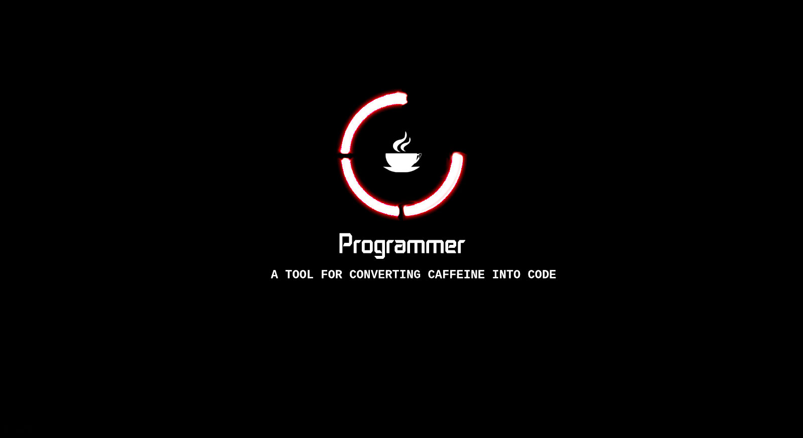

<h1 align="center">👋</h1>

<p align="center">
  
</p>

<h1 align="center">⏳ Year Progress</h1>

<p align="center">
  <a href="https://github.com/jrohitofficial">
    
  </a>
</p>

<!-- YEAR_PROGRESS_START -->
```
[ ☣️ Year Progress | 2026-04-25 12:58:49 ]
[ ⡿⡿⡿⡿⡿⠀⠀⠀⠀⠀⠀⠀⠀⠀⠀⠀ ] 31.38%
<Syncing UTC...>
```

[](https://github.com/mdsarfarazalam840)
*⚡ CI monitored; status auto-updates.*

<!-- YEAR_PROGRESS_END -->





<p align="center">
  
</p>


<p align="center">
  
</p>

<!-- 

-->

<br>


<!-- Technical Skills -->

                 
 


<p align="center">


<p align="center">


<!--[](https://github.com/ashutosh00710/github-readme-activity-graph)-->
[](https://github.com/ashutosh00710/github-readme-activity-graph)


  

  

 <p align="center">
   <a href="https://discordapp.com/users/MdSarfaraz#0520" target="blank"></a> <a href="https://www.linkedin.com/in/md-alam-bb809240/" target="blank"></a>  
   
<br>
<br>
<a href="https://twitter.com/MdSarfaraz840" target="blank"></a>
</p>  
  

  
<!--
**mdsarfarazalam840/mdsarfarazalam840** is a ✨ _special_ ✨ repository because its `README.md` (this file) appears on your GitHub profile.

Here are some ideas to get you started:

- 🔭 I’m currently working on ...
- 🌱 I’m currently learning ...
- 👯 I’m looking to collaborate on ...
- 🤔 I’m looking for help with ...
- 💬 Ask me about ...
- 📫 How to reach me: ...
- 😄 Pronouns: ...
- ⚡ Fun fact: ...
-->


<!--START_SECTION:waka-->


**🐱 My GitHub Data** 

> 📦 59.6 kB Used in GitHub's Storage 
 > 
> 🏆 128 Contributions in the Year 2026
 > 
> 💼 Opted to Hire
 > 
> 📜 136 Public Repositories 
 > 
> 🔑 0 Private Repositories 
 > 
**I'm a Night 🦉** 

```text
🌞 Morning                98 commits          ██████░░░░░░░░░░░░░░░░░░░   23.96 % 
🌆 Daytime                94 commits          ██████░░░░░░░░░░░░░░░░░░░   22.98 % 
🌃 Evening                157 commits         ██████████░░░░░░░░░░░░░░░   38.39 % 
🌙 Night                  60 commits          ████░░░░░░░░░░░░░░░░░░░░░   14.67 % 
```
📅 **I'm Most Productive on Tuesday** 

```text
Monday                   70 commits          ████░░░░░░░░░░░░░░░░░░░░░   17.11 % 
Tuesday                  108 commits         ███████░░░░░░░░░░░░░░░░░░   26.41 % 
Wednesday                81 commits          █████░░░░░░░░░░░░░░░░░░░░   19.80 % 
Thursday                 10 commits          █░░░░░░░░░░░░░░░░░░░░░░░░   02.44 % 
Friday                   56 commits          ███░░░░░░░░░░░░░░░░░░░░░░   13.69 % 
Saturday                 10 commits          █░░░░░░░░░░░░░░░░░░░░░░░░   02.44 % 
Sunday                   74 commits          █████░░░░░░░░░░░░░░░░░░░░   18.09 % 
```


📊 **This Week I Spent My Time On** 

```text
🕑︎ Time Zone: Asia/Kolkata

💬 Programming Languages: 
JavaScript               2 hrs 3 mins        █████████░░░░░░░░░░░░░░░░   36.12 % 
YAML                     41 mins             ███░░░░░░░░░░░░░░░░░░░░░░   12.29 % 
Markdown                 33 mins             ██░░░░░░░░░░░░░░░░░░░░░░░   09.85 % 
Python                   25 mins             ██░░░░░░░░░░░░░░░░░░░░░░░   07.39 % 
Bash                     24 mins             ██░░░░░░░░░░░░░░░░░░░░░░░   07.09 % 

🔥 Editors: 
VS Code                  4 hrs 18 mins       ███████████████████░░░░░░   75.73 % 
Antigravity              1 hr 22 mins        ██████░░░░░░░░░░░░░░░░░░░   24.27 % 

🐱‍💻 Projects: 
ai-agentrouter           2 hrs 25 mins       ███████████░░░░░░░░░░░░░░   42.73 % 
Devops-learning          1 hr 10 mins        █████░░░░░░░░░░░░░░░░░░░░   20.76 % 
torr_scrapper            1 hr 3 mins         █████░░░░░░░░░░░░░░░░░░░░   18.67 % 
terra-infra              30 mins             ██░░░░░░░░░░░░░░░░░░░░░░░   09.02 % 
Auto-GH-Vulnerabilities  26 mins             ██░░░░░░░░░░░░░░░░░░░░░░░   07.69 % 

💻 Operating System: 
Windows                  5 hrs 40 mins       █████████████████████████   100.00 % 
```

**I Mostly Code in JavaScript** 

```text
JavaScript               11 repos            ███████░░░░░░░░░░░░░░░░░░   28.95 % 
Python                   11 repos            ███████░░░░░░░░░░░░░░░░░░   28.95 % 
TypeScript               6 repos             ████░░░░░░░░░░░░░░░░░░░░░   15.79 % 
CSS                      1 repo              █░░░░░░░░░░░░░░░░░░░░░░░░   02.63 % 
PowerShell               1 repo              █░░░░░░░░░░░░░░░░░░░░░░░░   02.63 % 
```


 Last Updated on 25/04/2026 03:21:04 UTC
<!--END_SECTION:waka-->


## 🤖 AI Insights

> This section is automatically generated using AI every 6 hours ⚡


## 🧠 AI Suggestions
<!-- AI_SUGGESTIONS_START -->
Here's an analysis of the GitHub profile:

### Strengths

*   **Clear Specialization:** Bio indicates a focus on Open Source and Azure-focused DevOps.
*   **Active Contributor:** High number of public repositories (136) suggests consistent activity.
*   **Emerging AI/ML Interest:** Repos like `claude-code` and `VulnFix-AI` show engagement with cutting-edge AI technologies in development.
*   **Modern Technologies:** Use of TypeScript in some projects.

### Weaknesses

*   **Low Engagement/Stars:** Most repositories have 0 stars, including the profile repo itself, which might indicate limited community impact or visibility.
*   **Limited Project Descriptions:** Many repositories have `null` descriptions, making it hard to understand their purpose or content.
*   **Rookie Project Status:** `mdsarfarazalam840` (profile repo) having only 1 star and `ai-agentrouter` having 0 stars suggests these might be early-stage or personal projects without broad adoption yet.

### Suggestions

*   **Enhance Repository Descriptions:** Add concise and informative descriptions to all repositories to clearly communicate their purpose and functionality.
*   **Showcase Top Projects:** Ensure more impactful or completed projects are highlighted, perhaps by having a dedicated "pinned repositories" section or ensuring top contributors are visible.
*   **Seek Community Feedback:** Encourage contributions or feedback on projects to increase engagement and improve their visibility.
*   **Add READMEs:** Include detailed README files for each project, explaining setup, usage, and contribution guidelines.
<!-- AI_SUGGESTIONS_END -->

## 🚀 AI Improvements
<!-- AI_IMPROVEMENTS_START -->
Let's break down how to improve your GitHub profile, focusing on README, Projects, and Visibility, using your current username and repositories as a starting point.

## Overall Profile Impression & Username

**Username:** `mdsarfarazalam840`

*   **Potential Improvement:** While functional, numbers at the end of a username can sometimes feel less professional or harder to remember. If possible and if you have an alternative that's more descriptive or your name without numbers, consider it. However, if this is your established handle, it's not a deal-breaker, and we can compensate with other elements.

## README Enhancements

Your README is the **gateway** to your profile. It needs to tell visitors quickly and effectively who you are, what you do, and what makes you interesting.

**Current (Assumed):** Likely minimal or generic.

**Suggestions:**

1.  **"Hello World" - Purposeful Introduction:**
    *   **Headline:** Start with a clear, concise statement about yourself. Examples:
        *   "AI Enthusiast & Full-Stack Developer | Building Intelligent Solutions"
        *   "Software Engineer focused on AI and Cloud Technologies"
        *   "Passionate about creating innovative AI-powered applications"
    *   **About Me Section:** Briefly introduce yourself, your main interests, and your passion.
        *   Mention your primary tech stacks and areas of expertise (e.g., Python, Machine Learning, Cloud, Web Development).
        *   Highlight what you enjoy building or solving.
        *   Example: "I'm Sarfaraz Alam, a software developer with a keen interest in Artificial Intelligence and its practical applications. I enjoy building robust and scalable applications, and I'm particularly drawn to the challenges of creating intelligent agents and improving code security. My current focus is on leveraging LLMs and cloud platforms to solve complex problems."

2.
<!-- AI_IMPROVEMENTS_END -->


## 📊 Weekly AI Report

<!-- WEEKLY_REPORT_START -->
### Strengths
- **High activity level**: 136 public repositories demonstrate prolific output and commitment to open source.[1]
- **Azure DevOps expertise**: Bio highlights focus on cloud-native automation, aligning with top repos like ai-agentrouter, claude-code, and VulnFix-AI (AI/DevOps themes).[2][3]
- **Diverse portfolio**: Repos span AI tools, portfolios (e.g., 3D-portfolio, developer-portfolios), cloud apps (own-drive), and utilities (SpotiFLAC), showcasing versatility.[1][6]

### Weaknesses
- **Unclear impact metrics**: No data on stars, forks, or contributors; top repos listed without popularity indicators suggests limited adoption.[3][9]
- **Generic naming**: Username and first repo (mdsarfarazalam840) lack branding; bio is solid but could quantify achievements.[3]
- **Scattered focus**: Mix of AI, portfolios, acquisitions, and media tools may dilute DevOps specialization.[6]

### Suggestions
- Pin 4-6 high-impact repos with strong READMEs to highlight Azure/DevOps work.[3]
- Add metrics to bio (e.g., "Automated 50+ Azure pipelines") and include links to portfolio/site.[3][8]
- Boost visibility: Encourage stars/forks, add languages/stars to repo list, and contribute to popular projects.[1][5]
<!-- WEEKLY_REPORT_END -->


---
### :zap: Recent Activity
[](https://github.com/anuraghazra/github-readme-stats)

<!--START_SECTION:activity-->

<!--END_SECTION:activity-->
---


<p align="center">
  
</p>

