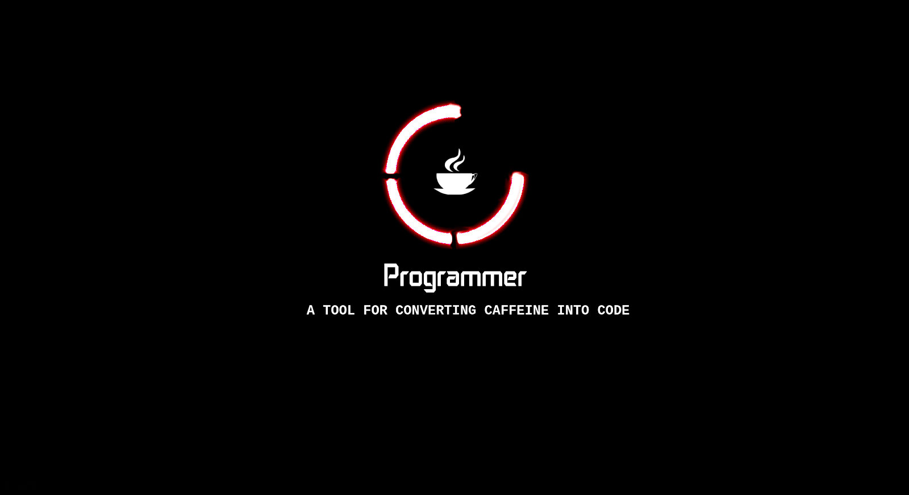
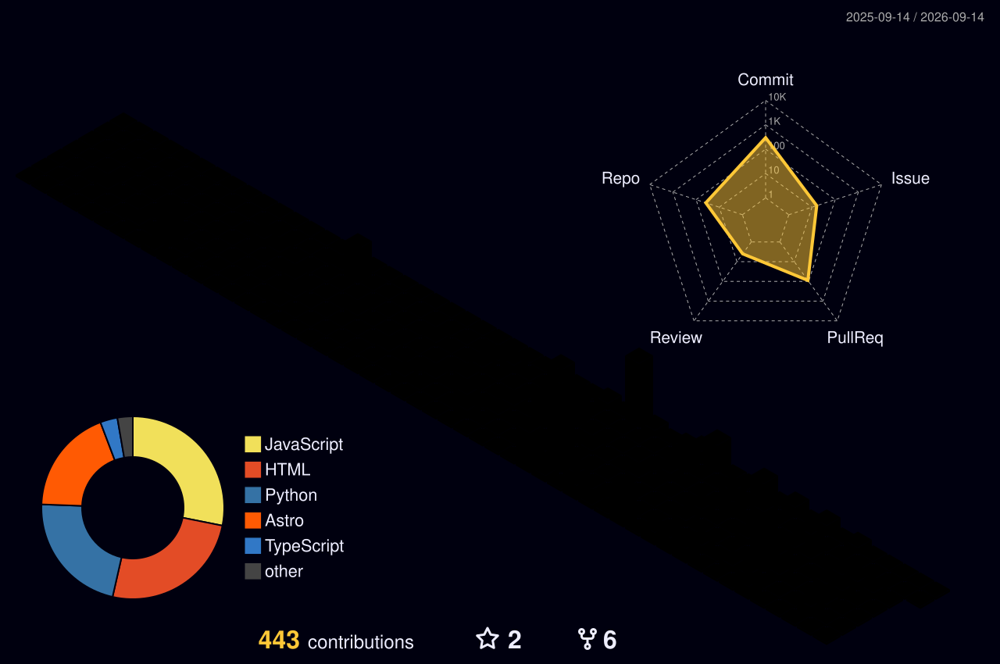

<h1 align="center">👋</h1>

<p align="center">
  
</p>

<h1 align="center">⏳ Year Progress</h1>

<p align="center">
  <a href="https://github.com/jrohitofficial">
    
  </a>
</p>

<!-- YEAR_PROGRESS_START -->
```
[ ☣️ Year Progress | 2026-09-05 02:52:52 ]
[ ⡿⡿⡿⡿⡿⡿⡿⡿⡿⡿⠿⠀⠀⠀⠀⠀ ] 67.70%
<Compiling vector...>
```

[](https://github.com/mdsarfarazalam840)
*⚡ CI monitored; status auto-updates.*

<!-- YEAR_PROGRESS_END -->

<!-- Neofetch-style card. Numbers are refreshed daily in-repo by
     .github/workflows/neofetch-card.yml, so nothing here depends on a
     third-party host that can go down. To change what the card says, edit the
     LINES list in tools/build_neofetch_svg.py and re-run it. Raw URLs (not
     relative paths) are required for the dark/light swap to work. -->
<a href="https://github.com/mdsarfarazalam840/mdsarfarazalam840">
  <picture>
    <source media="(prefers-color-scheme: dark)" srcset="https://raw.githubusercontent.com/mdsarfarazalam840/mdsarfarazalam840/main/dark_mode.svg">
    
  </picture>
</a>





<p align="center">
  
</p>


<p align="center">
  
</p>

<!-- 

-->

<br>


<!-- Technical Skills -->

                 
 


<!-- Self-hosted instance, because the public github-readme-stats.vercel.app is
     permanently 503 DEPLOYMENT_PAUSED. This instance needs a PAT_1 env var
     (GitHub PAT, no scopes required) in its Vercel project settings. -->
<p align="center">


<!-- streak-stats.demolab.com is the maintained home; the old herokuapp host died with Heroku's free tier. -->
<p align="center">


<!-- Activity graph. The upstream host github-readme-activity-graph.vercel.app now returns
     402 DEPLOYMENT_DISABLED, and the old herokuapp / cyclic.sh hosts are gone.
     activity-graph.vercel.app runs the same service and is live.
     Instant fallbacks if this one ever dies, in order of preference:
       1. https://github-activity-graph.vercel.app/graph?username=...   (identical output)
       2. https://ghchart.rshah.org/mdsarfarazalam840                   (year heatmap, different look)
       3. Deploy your own: github.com/Ashutosh00710/github-readme-activity-graph (env var: TOKEN) -->
[](https://github.com/Ashutosh00710/github-readme-activity-graph)

<h3 align="center">🧊 3D Contribution Calendar</h3>

<!-- Generated in-repo by .github/workflows/profile-3d.yml, so there is no third-party
     host that can go down. Swap the filename for a different style:
       profile-night-rainbow  profile-night-view   profile-night-green
       profile-gitblock       profile-green        profile-green-animate
       profile-season         profile-season-animate
       profile-south-season   profile-south-season-animate
     Run the workflow once (Actions -> 3D Contribution Calendar -> Run workflow)
     to create the file before this image will render. -->
<p align="center">
  
</p>


  

  

 <p align="center">
   <a href="https://discordapp.com/users/MdSarfaraz#0520" target="blank"></a> <a href="https://www.linkedin.com/in/md-alam-bb809240/" target="blank"></a>  
   
<br>
<br>
<a href="https://twitter.com/MdSarfaraz840" target="blank"></a>
</p>  
  

  
<!--
**mdsarfarazalam840/mdsarfarazalam840** is a ✨ _special_ ✨ repository because its `README.md` (this file) appears on your GitHub profile.

Here are some ideas to get you started:

- 🔭 I’m currently working on ...
- 🌱 I’m currently learning ...
- 👯 I’m looking to collaborate on ...
- 🤔 I’m looking for help with ...
- 💬 Ask me about ...
- 📫 How to reach me: ...
- 😄 Pronouns: ...
- ⚡ Fun fact: ...
-->


<!--START_SECTION:waka-->


**🐱 My GitHub Data** 

> 📦 128.1 kB Used in GitHub's Storage 
 > 
> 🏆 413 Contributions in the Year 2026
 > 
> 💼 Opted to Hire
 > 
> 📜 146 Public Repositories 
 > 
> 🔑 1 Private Repositories 
 > 
**I'm an Early 🐤** 

```text
🌞 Morning                295 commits         ██████░░░░░░░░░░░░░░░░░░░   25.54 % 
🌆 Daytime                360 commits         ████████░░░░░░░░░░░░░░░░░   31.17 % 
🌃 Evening                420 commits         █████████░░░░░░░░░░░░░░░░   36.36 % 
🌙 Night                  80 commits          ██░░░░░░░░░░░░░░░░░░░░░░░   06.93 % 
```
📅 **I'm Most Productive on Sunday** 

```text
Monday                   140 commits         ███░░░░░░░░░░░░░░░░░░░░░░   12.12 % 
Tuesday                  190 commits         ████░░░░░░░░░░░░░░░░░░░░░   16.45 % 
Wednesday                212 commits         █████░░░░░░░░░░░░░░░░░░░░   18.35 % 
Thursday                 50 commits          █░░░░░░░░░░░░░░░░░░░░░░░░   04.33 % 
Friday                   124 commits         ███░░░░░░░░░░░░░░░░░░░░░░   10.74 % 
Saturday                 179 commits         ████░░░░░░░░░░░░░░░░░░░░░   15.50 % 
Sunday                   260 commits         ██████░░░░░░░░░░░░░░░░░░░   22.51 % 
```


📊 **This Week I Spent My Time On** 

```text
🕑︎ Time Zone: Asia/Kolkata

💬 Programming Languages: 
TypeScript               1 hr 46 mins        ██████████░░░░░░░░░░░░░░░   41.60 % 
Python                   1 hr 28 mins        █████████░░░░░░░░░░░░░░░░   34.55 % 
Markdown                 30 mins             ███░░░░░░░░░░░░░░░░░░░░░░   11.86 % 
JSON                     24 mins             ██░░░░░░░░░░░░░░░░░░░░░░░   09.49 % 
Git Config               2 mins              ░░░░░░░░░░░░░░░░░░░░░░░░░   01.10 % 

🔥 Editors: 
Claude Code              4 hrs 7 mins        ████████████████████████░   97.05 % 
VS Code                  7 mins              █░░░░░░░░░░░░░░░░░░░░░░░░   02.95 % 

🐱‍💻 Projects: 
Quran-website            2 hrs 46 mins       ████████████████░░░░░░░░░   65.29 % 
mdsarfarazalam840        1 hr 28 mins        █████████░░░░░░░░░░░░░░░░   34.71 % 

💻 Operating System: 
Windows                  4 hrs 15 mins       █████████████████████████   100.00 % 
```

🤖 **AI Coding This Week** 

```text
⏱ AI Coding Time: 4 hrs 12 mins (98.72%)

✍️ 3,084 lines written by AI, 0 lines written by hand (100.0% AI-written)

🔤 2,304,841 Input Tokens, 199,367 Output Tokens

💵 $31.74 Estimated AI Cost This Week

🧠 4 AI Sessions, 19 AI Prompts

Opus                     3,117 lines         █████████████████████████   100.00 % 

🔎 AI Coding Insights:
🤖 AI-Driven — 100.0% of written lines came from AI
📚 Verbose Prompter — average 37,844 characters per prompt
🔁 Iterative Prompter — average 5 prompts per session
🚀 High AI Trust — 0.0% of changed lines were hand-edited
```

**I Mostly Code in JavaScript** 

```text
JavaScript               15 repos            ████████░░░░░░░░░░░░░░░░░   32.61 % 
TypeScript               7 repos             ████░░░░░░░░░░░░░░░░░░░░░   15.22 % 
HTML                     4 repos             ██░░░░░░░░░░░░░░░░░░░░░░░   08.70 % 
MDX                      1 repo              █░░░░░░░░░░░░░░░░░░░░░░░░   02.17 % 
Astro                    1 repo              █░░░░░░░░░░░░░░░░░░░░░░░░   02.17 % 
```


 Last Updated on 05/09/2026 04:05:48 UTC
<!--END_SECTION:waka-->


## 🤖 AI Insights

> This section is automatically generated using AI every 6 hours ⚡


## 🧠 AI Suggestions
<!-- AI_SUGGESTIONS_START -->
## GitHub profile snapshot

- Username: mdsarfarazalam840
- Public repos: 146
- Recent repos: mdsarfarazalam840, Islamic-website, Azure_GCP_AWS_Knowledgebase, freemoviesuggestion, 3D-portfolio

AI provider did not respond in time. Basic health of this function is OK, and GitHub profile fetch worked.
<!-- AI_SUGGESTIONS_END -->

## 🚀 AI Improvements
<!-- AI_IMPROVEMENTS_START -->
## GitHub profile snapshot

- Username: mdsarfarazalam840
- Public repos: 146
- Recent repos: mdsarfarazalam840, Islamic-website, Azure_GCP_AWS_Knowledgebase, freemoviesuggestion, 3D-portfolio

AI provider did not respond in time. Basic health of this function is OK, and GitHub profile fetch worked.
<!-- AI_IMPROVEMENTS_END -->


## 📊 Weekly AI Report

<!-- WEEKLY_REPORT_START -->

<!-- WEEKLY_REPORT_END -->


---
### :zap: Recent Activity
[](https://github.com/anuraghazra/github-readme-stats)

<!--START_SECTION:activity-->

<!--END_SECTION:activity-->
---


<p align="center">
  
</p>

